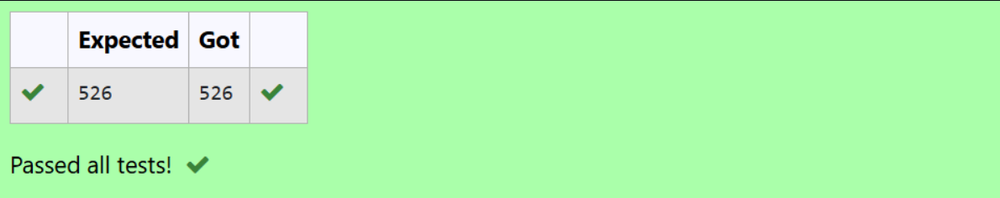

# List Operations in Python: Sum of List Items

## 🎯 Aim
To write a Python program that calculates the **sum of all elements** in a list.

## 🧠 Algorithm
1. Define a list of numbers.
2. Use Python’s built-in `sum()` function to calculate the total.
3. Print the result.

## 🧾 Program
```
numbers = [1, 2, 3, 4, 5]  # Example list
total = sum(numbers)
print(total)


```
## Output


## Result
A Python program that calculates the **sum of all elements** in a list was completed successfully and output was generated.